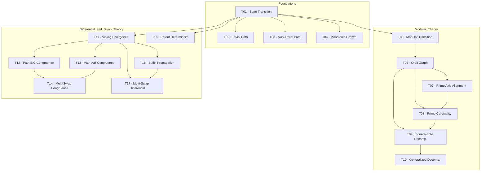

# Dependency Graph & Reading Order

This document gives an AI agent (or reviewer) an explicit map of the logical
structure so files can be read or validated in a valid order. Edges are taken from
explicit `Theorem N` citations in the source text, plus the foundational dependency
of state-manipulating results on the state representation (T01).

## Clusters

- **Foundations (T01–T04):** the linear state model, existence of trivial /
  non-trivial paths, and monotonic descent.
- **Modular Theory (T05–T10):** projecting the infinite tree into finite rings and
  decomposing orbits via CRT / Hensel lifting.
- **Differential & Swap Theory (T11–T17):** how sibling/branch swaps perturb the
  state, and the exact congruences and lattice formulas they obey. The single-swap
  differential (T15) feeds the multi-swap differential (T17).

## Graph



## A Valid Topological Reading Order

(Any linear extension of the graph works; this is one of them.)

1. [T01 — Linearized Algebraic State Transition](../theorems/T01-linearized-state-transition.md)
2. [T02 — Trivial Path (Unique Existence)](../theorems/T02-trivial-path-existence.md)
3. [T03 — Non-Trivial Unique Path (Unique Existence)](../theorems/T03-nontrivial-path-existence.md)
4. [T04 — Monotonic Growth](../theorems/T04-monotonic-growth.md)
5. [T05 — Modular Algebraic State Transition](../theorems/T05-modular-state-transition.md)
6. [T06 — Modular Orbit Graph (Finite State Machine)](../theorems/T06-modular-orbit-graph.md)
7. [T07 — Prime Modular Axis Alignment](../theorems/T07-prime-axis-alignment.md)
8. [T08 — Prime Modular Orbit Cardinality](../theorems/T08-prime-orbit-cardinality.md)
9. [T09 — Square-Free Modular Orbit Decomposition](../theorems/T09-squarefree-orbit-decomposition.md)
10. [T10 — Generalized Modular Orbit Decomposition](../theorems/T10-generalized-orbit-decomposition.md)
11. [T11 — Sibling Divergence](../theorems/T11-sibling-divergence.md)
12. [T12 — Path B/C Modular Congruence](../theorems/T12-path-bc-congruence.md)
13. [T13 — Path A/B Modular Congruence](../theorems/T13-path-ab-congruence.md)
14. [T14 — Multiple Swaps Modular Congruence](../theorems/T14-multiswap-congruence.md)
15. [T15 — Differential Suffix Propagation](../theorems/T15-differential-suffix-propagation.md)
16. [T16 — Geometric Parent Determinism](../theorems/T16-geometric-parent-determinism.md)
17. [T17 — Multi-Swap Differential](../theorems/T17-multiswap-differential.md)

## Edge List (machine-readable)

```yaml
edges:
  - from: T01
    to: T02
  - from: T01
    to: T03
  - from: T01
    to: T04
  - from: T01
    to: T05
  - from: T05
    to: T06
  - from: T06
    to: T07
  - from: T06
    to: T08
  - from: T07
    to: T08
  - from: T06
    to: T09
  - from: T08
    to: T09
  - from: T09
    to: T10
  - from: T01
    to: T11
  - from: T11
    to: T12
  - from: T11
    to: T13
  - from: T12
    to: T14
  - from: T13
    to: T14
  - from: T11
    to: T15
  - from: T01
    to: T16
  - from: T11
    to: T17
  - from: T15
    to: T17
```
